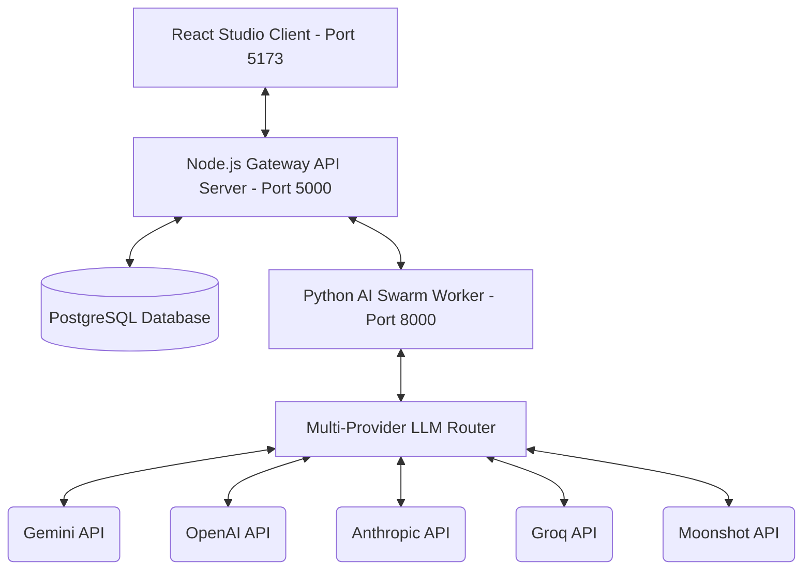

# PublishFlow AI Swarm Orchestrator

PublishFlow AI is a multi-agent AI book publishing platform designed to automate outline design, manuscript drafting, and fact-auditing for Kindle Direct Publishing (KDP).

---

## 1. Architectural Blueprint

The application follows a distributed multi-service architecture coordinating between three main components:



### Component Details
1. **React Frontend Studio (client/frontend)**: A desktop-optimized studio interface with rich aesthetics, real-time logging terminal, proofreader audio controls, margin guidelines, and outline scaling triggers.
2. **Node.js Express Gateway (server)**: Handles user authentication, session JWTs, project state transitions, PostgreSQL transactions (using Prisma ORM), and proxies export streams and logs.
3. **Python AI Worker (python_service)**: Houses the multi-agent swarm pipeline. Uses standard client libraries to access Gemini, OpenAI, Anthropic, Kimi, and Groq via a custom `LLMRouter` with automatic failover support.

---

## 2. Multi-Service Setup Guide

### Option A: Direct Local Run (Recommended for Dev)
To spin up all services concurrently:
1. **Install Root Orchestration Dependencies**:
   ```bash
   npm install
   ```
2. **Install Service Dependencies**:
   ```bash
   npm run install:all
   ```
3. **Configure Environment Files**:
   Create `.env` files in `server/`, `frontend/`, and `python_service/` using [Master Environment File Template](.env.example).
4. **Boot Up Services**:
   ```bash
   npm run dev
   ```
   *This starts the Express server (5000), Vite client (5173), and Python worker (8000) concurrently.*

### Option B: Docker Compose Spin-up
To build and run all services (including a PostgreSQL database container) with a single command:
```bash
docker-compose up --build
```

---

## 3. API Endpoint Reference

| Service | Method | Route | Description | Authentication |
| :--- | :--- | :--- | :--- | :--- |
| **Node Gateway** | `POST` | `/api/auth/register` | Register new user | Public |
| **Node Gateway** | `POST` | `/api/auth/login` | Login and retrieve JWT | Public |
| **Node Gateway** | `GET` | `/api/projects` | List projects for user | JWT Header |
| **Node Gateway** | `POST` | `/api/projects` | Initialize a new project workspace | JWT Header |
| **Node Gateway** | `GET` | `/api/projects/:id` | Retrieve book details and manuscript structure | JWT Header |
| **Node Gateway** | `POST` | `/api/swarm/generate-outline`| Swarm-generate Table of Contents & refinement questions | JWT Header |
| **Node Gateway** | `POST` | `/api/swarm/approve-outline` | Approve outline and transition project status to `in_progress` | JWT Header |
| **Node Gateway** | `POST` | `/api/swarm/write-chapter` | Run multi-agent pipeline (Write ➔ Edit ➔ Audit) | JWT Header |
| **Node Gateway** | `GET` | `/api/swarm/logs/:projectId`| Proxy endpoint to stream real-time SSE log events | Query Token |
| **Node Gateway** | `GET` | `/api/export/:projectId/docx`| Stream KDP-ready Word document export | JWT Header |
| **Node Gateway** | `GET` | `/api/export/:projectId/pdf` | Stream KDP-ready formatted PDF export | JWT Header |
| **Python Worker** | `POST` | `/internal/swarm/outline` | Generate Outline structure via Architect Agent | Internal Only |
| **Python Worker** | `POST` | `/internal/swarm/write-chapter`| Execute sequential writing, editing, and fact-checks | Internal Only |
| **Python Worker** | `GET` | `/internal/logs/:projectId` | Event stream of execution logs | Internal Only |

---

## 4. Master Environment Reference (`.env`)

Refer to the master template at [Master Env File Template](.env.example) for environment settings.

---

## 5. Test Suite Instructions

### Python Worker Tests (Pytest)
Make sure the Python virtual environment is active, then run:
```bash
cd python_service
venv\Scripts\python -m pytest tests/
```
Tests cover:
- Multi-provider adapter fallback sequences.
- Fact-auditor entity extraction and DuckDuckGo search verification.
- Editor agent two-step copying, editing, and cadence rewriting.

### Node Gateway Tests (Jest/Mocha/Supertest)
Run the Node-side API testing script:
```bash
cd server
npm test
```
